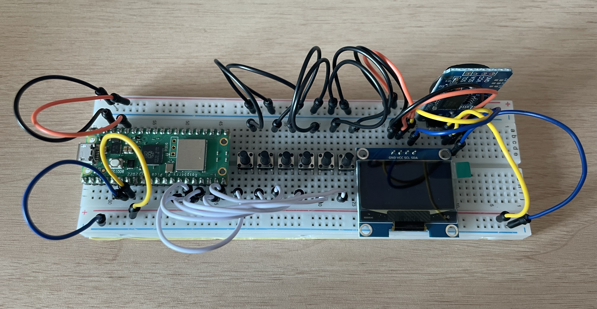
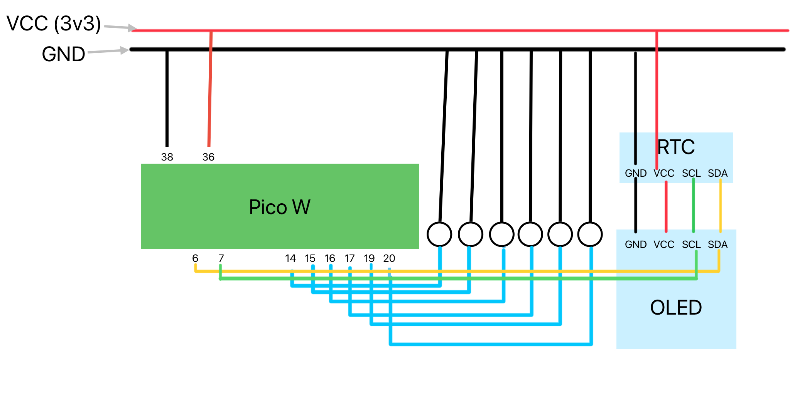

# PicoW-Mood-Tracker: OOP-based IoT Logger

IoT mood tracking system built with Raspberry Pi Pico W. This project demonstrates the integration of hardware sensors, local data persistence, and cloud synchronization using an Object-Oriented Programming (OOP) approach.

## 0.  Introduction

There are hundreds of mood-tracking apps out there, but let’s be honest: finding your phone, unlocking it, and navigating through menus just to log a feeling is tedious. I wanted something simpler—a physical device where a single **"Click"** does it all. 
As a Python learner only a few months into the journey, I was starting to get bored with results that only lived on a computer monitor. I needed something tactile. If you are a fellow beginner starting to feel the "Python slump," I hope this project serves as a refreshing break and reminds you how much fun coding can be when it interacts with the real world.

  
*Real-time mood logs as seen on the mobile Google Sheets app.* You can monitor your emotional trends directly from your smartphone using the Google Sheets app, anywhere and anytime.

## 1.  Key Features
- OOP Architecture: Modular design with dedicated managers for Display, WiFi, Logging, and Cloud Uploading.
- Hardware Integration: Real-time feedback via SH1106 OLED and precise timekeeping with DS3231 RTC.
- Data Resilience: Local CSV logging ensures no data loss during network outages.
- Cloud Sync: Seamless data transmission to Google Sheets via REST API.
- Reliability: Memory management and hardware debouncing for stable long-term operation.

## 2.  Tech Stack

- Language: MicroPython
- Hardware: Raspberry Pi Pico W, SH1106 OLED, DS3231 RTC, Tactile Buttons
- Cloud: Google Apps Script (Web App)

## 💡 Wiring Guide & Tips

To ensure a stable connection and prevent hardware damage, please follow these guidelines:

### General Wiring Tips
* **I2C Sharing**: Both the OLED display and the RTC module use the I2C protocol. You can connect both **SDA** and **SCL** lines to the same GPIO pins on the Pico W.
* **Power Check**: Double-check the **VCC (3.3V)** and **GND** pins before powering on. Reversing these can permanently damage your sensors.
* **Bus Line Strategy**: If possible, use the long power rails (side strips) on the breadboard as dedicated "Bus Lines" for VCC, GND, SDA, and SCL for easier management.

### Button Connection (Tactile Switch)
* **Diagonal Wiring**: For 4-pin tactile buttons, it is highly recommended to connect the **GPIO wire** and **GND wire** to pins located **diagonally** from each other. This ensures a stable connection regardless of the internal switch structure.
* **Pull-up Resistor**: This project uses internal pull-up resistors (`Pin.PULL_UP`), so you only need to connect one side of the button to the GPIO and the other to GND.

### Tip for Hobbyists
* Using different colored wires (e.g., Red for VCC, Black for GND, Yellow for SCL, Blue for SDA) makes debugging significantly easier when something goes wrong!

## 3. Project Journey: From Script to System

This project evolved through a rigorous refactoring process.
(1) Monolithic Script: Initial proof-of-concept.
(2) Refactoring (OOP): Transitioned to class-based design for better encapsulation.
(3) Modularization: Decoupled components into 5 distinct modules for professional maintenance and scalability.

## 4. Project Structure

- **main.py** : Must be saved directly to Pico.
- **lib/** : Containing functional modules.
  - **display_manager.py** : Handles I2C for SH1106 OLED & DS3231 RTC.
  - **wifi_manager.py** : Manage Pico W's wireless connectivity.
  - **local_logger.py** : Provides persistent CSV logging (offline storage).
  - **google_uploader.py** : Syncs data with Google Sheets API.
  - **sh1106.py** : MicroPython Driver for OLED. *(See below 7. Credits & Acknowledgments)*
  - **ds3231.py** : Lightweight RTC Driver focused on I2C communication and BCD-decimal conversion.
- **images/** : Contain hardware schematics and project photos.
- **secrets_template.py** : Template for environment variables (wifi / API).

## 5. How to Install & Run

This project uses **Thonny IDE** to upload and run code on the Raspberry Pi Pico W.

### 1) Prerequisites
* Install [Thonny IDE](https://thonny.org/).
* Connect your Pico W to your computer via USB.
* Ensure MicroPython firmware is installed on your Pico W.

### 2) Setup Secrets
1. Locate `secrets_template.py` in this repository.
2. Rename it to `secrets.py`.
3. Open `secrets.py` and enter your WiFi SSID, Password, and your Google Apps Script URL.

### 3) Upload Files to Pico W
1. Open Thonny IDE.
2. Go to **File > Open...** and select all files from the `lib/` folder and the `main.py` file from your local machine.
3. For each file, go to **File > Save as...** and select **Raspberry Pi Pico**.
4. **Important:** * Save the contents of the `lib/` folder (e.g., `display_manager.py`, `wifi_manager.py`, etc.) into a folder named `lib` on the Pico.
   * Save `main.py` and `secrets.py` directly in the root directory of the Pico.
   * Don't forget to include hardware drivers.

### 4) Run
1. Disconnect and reconnect the USB, or simply press the **Run** button in Thonny.
2. Your Pico W will now start tracking your mood!

   
## 6. Security Note
   
secrets.py (containing WiFi credentials and Google API URLs) is excluded from this repository for security reasons. Please use secrets_template.py as a reference.

## 7. Credits & Acknowledgments

This project utilizes a combination of open-source libraries and custom-built drivers:

* **SH1106 MicroPython Driver**: Created by [Radomir Dopieralski](https://github.com/deshipu), [Robert Hammelrath](https://github.com/robert-hh), and [Tim Weber](https://github.com/scy).
    * Original Repository: [robert-hh/SH1106](https://github.com/robert-hh/SH1106)
    * License: MIT License
* **DS3231 Custom Driver**: Personally developed for this project, focusing on lightweight I2C communication and BCD-decimal conversion for RTC management.

Special thanks to the open-source contributors whose work made this DIY project possible.
